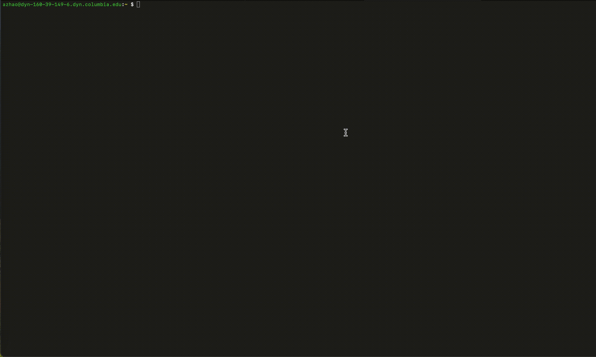

# Honeypot Assignment

**Time spent:** **10** hours spent in total

**Objective:** Create a honeynet using MHN-Admin. Present your findings as if you were requested to give a brief report of the current state of Internet security. Assume that your audience is a current employer who is questioning why the company should allocate anymore resources to the IT security team.

### MHN-Admin Deployment (Required)

**Summary:** How did you deploy it? Did you use GCP, AWS, Azure, Vagrant, VirtualBox, etc.?

Deployed using GCP virtual machines.

### Dionaea Honeypot Deployment (Required)

**Summary:** Briefly in your own words, what does dionaea do?

### Database Backup (Required) 

**Summary:** What is the RDBMS that MHN-Admin uses? What information does the exported JSON file record?

*Be sure to upload session.json directly to this GitHub repo/branch in order to get full credit.*

### Deploying Additional Honeypot(s) (Optional)

#### Snort Honeypot

**Summary:** What does this honeypot simulate and do for a security researcher?

### Malware Capture and Identification (Optional)

#### Windows Malware

**Summary:** How did you find it? Which honeypot captured it? What does each malware do?

MD5 Hash: *685bc2af410d86a742b59b96d116a7d9*

SHA1 Hash: *17c237b3bd6b63effa1c309c91f7203300eb07e2*

## Notes

Describe any challenges encountered while doing the assignment.
