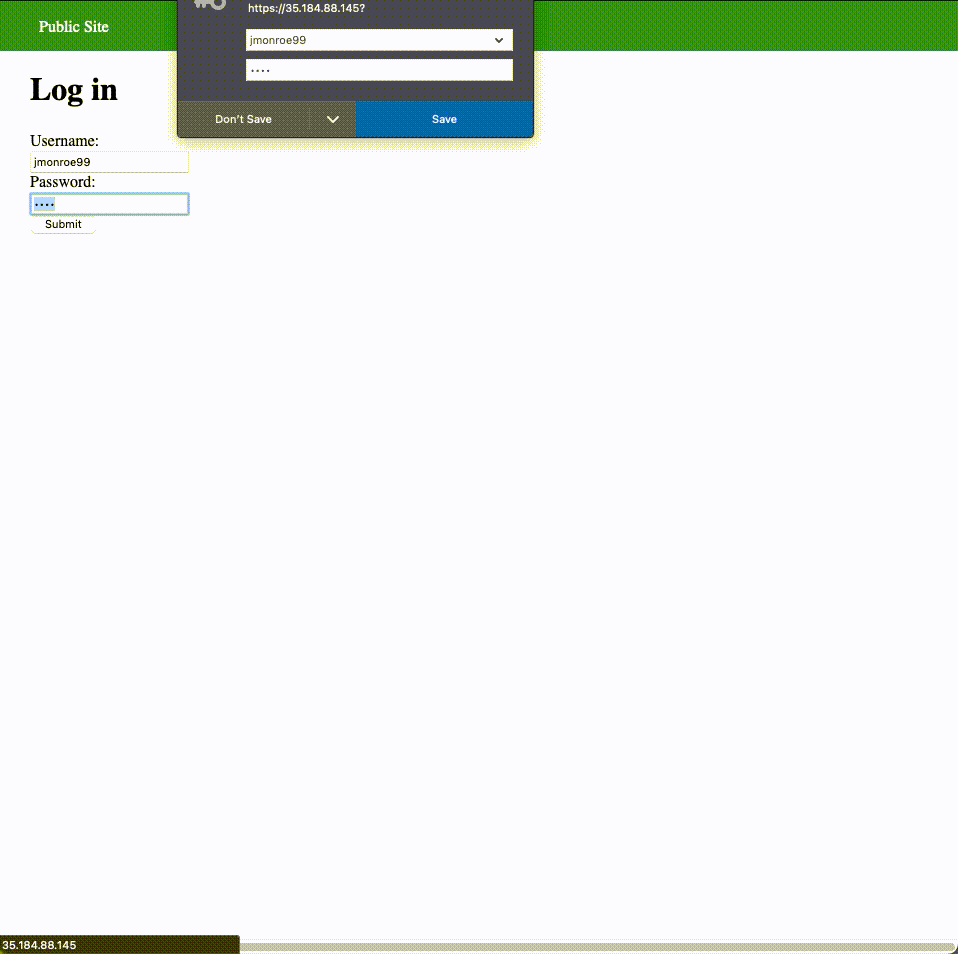

# Project 8 - Pentesting Live Targets

Time spent: **3** hours spent in total

> Objective: Identify vulnerabilities in three different versions of the Globitek website: blue, green, and red.

The six possible exploits are:

* Username Enumeration
* Insecure Direct Object Reference (IDOR)
* SQL Injection (SQLi)
* Cross-Site Scripting (XSS)
* Cross-Site Request Forgery (CSRF)
* Session Hijacking/Fixation

Each color is vulnerable to only 2 of the 6 possible exploits. First discover which color has the specific vulnerability, then write a short description of how to exploit it, and finally demonstrate it using screenshots compiled into a GIF.

## Blue

Vulnerability #1: SQL Injection

Description: SQL injection in query parameter.

Vulnerability #2: Session Hijacking

Description: Set session ID for admin. Intercept a non-user session through Burp and change session ID to gain admin access.

## Green

Vulnerability #1: User Enumeration

Description: Bolded "login was unsuccessful" vs. unbolded "login was unsuccessful" when providing a valid username vs. invalid username.

Vulnerability #2: XSS

Description: Injected Javascript code into the feedback form.

## Red

Vulnerability #1: IDOR

Description: Can find invalidated employee records by changing ID parameter.

Vulnerability #2: CSRF

Description: Uploaded a malicious link to change the data of the workers database.

## Notes

Describe any challenges encountered while doing the work

